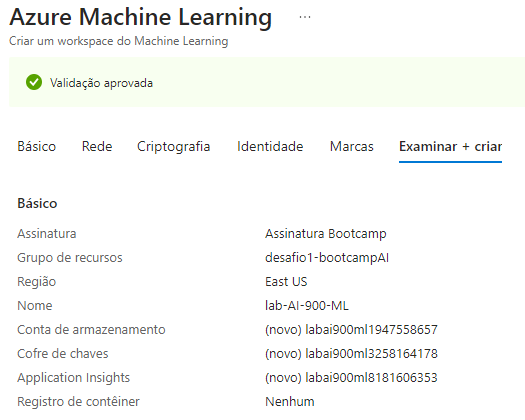
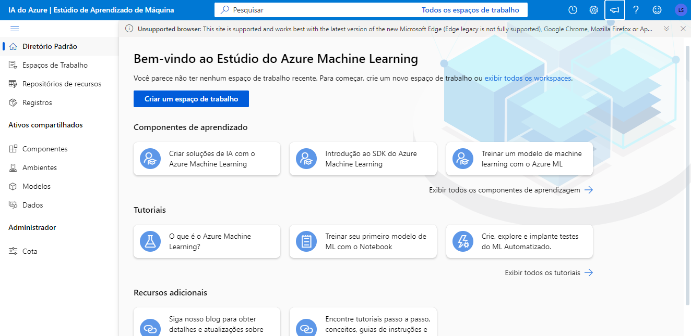
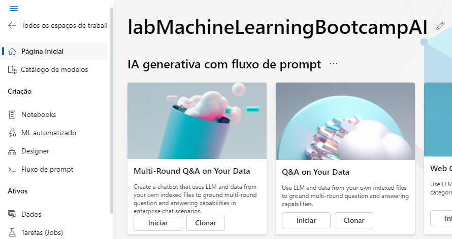
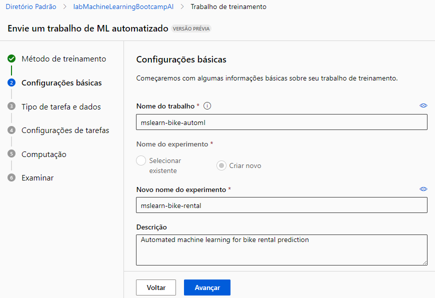
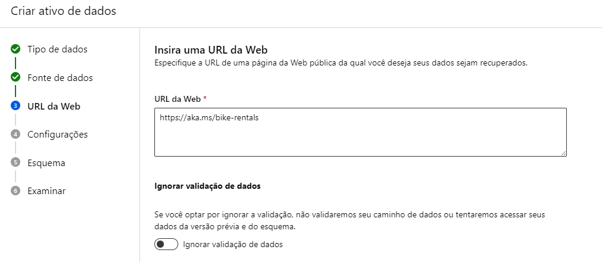
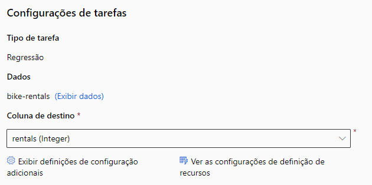
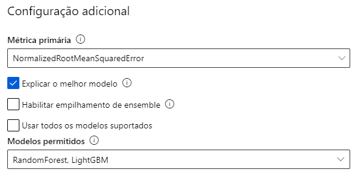
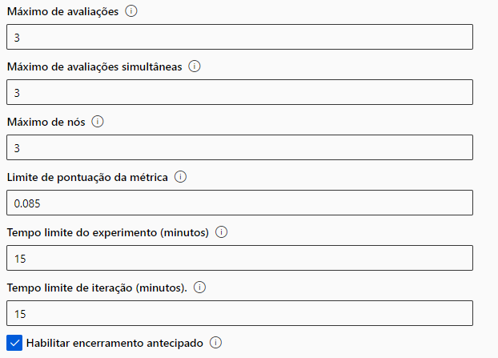
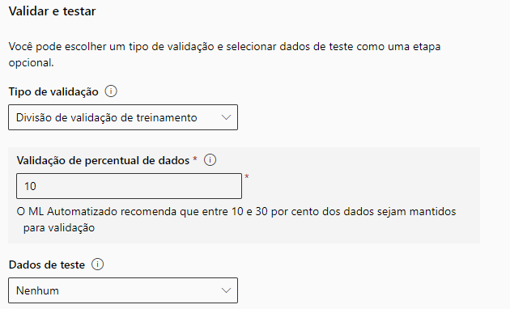
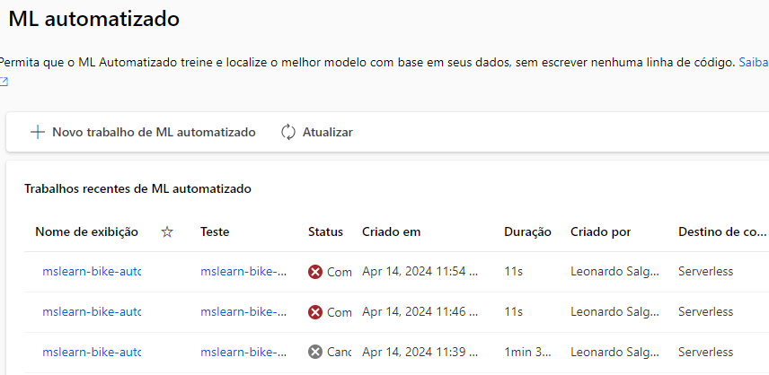

## Trabalhando com Machine Learning na Prática no Azure ML

### O que deve ser feito?
- [x] Crie um modelo de previsão com seus devidos pontos de extremidade configurados
- [x] Escreva o passo a passo desse processo em um readme.md de como você chegou nessa etapa
- [ ] Salve nesse repositório o readme.md e o arquivo .json de pontos de extremidade

### Procedimento

Esse procedimento foi feito baseado na [documentação da Microsoft](https://aka.ms/ai900-auto-ml).

1. Para começar, vamos criar um recurso de **Azure Machine Learning** no [Portal do Azure](https://portal.azure.com/#home).

2. Depois de criar o recurso, acesse o [estudio do Azure Machine Learning](https://ml.azure.com/?azure-portal=true).

3. Dentro do estudio, crie um workspace para trabalhar. Depois de criado, acesse o workspace e na barra da esquerda selecione _ML automatizado_.

4. Selecione _Novo trabalho de ML automatizado_ e preenchar os campos conforme a documentação da Microsoft.

5. Enquanto estiver configurando o trabalho, crie uma nova fonte de dados. O passo a passo para criar a fonte de dados também esta na documentação, e a Microsoft disponibiliza um csv com dados históricos de aluguel de bicicletas -> [https://aka.ms/bike-rentals](https://aka.ms/bike-rentals).

6. Na configuração de tarefas, a coluna de destino deve ser **rentals**

7. Nas **Configurações adicionais** desmarque a opção _Usar todos os modelos suportados_ e depois selecione apenas os modelos **RandomForest** e **LightGBM**. 

8. Expanda a sessão de **Limites** e configure conforme abaixo

9. Por fim, coloque **validar e testar** conforme abaixo

10. Na parte de computação, existe uma máquina virtual recomendada pela documentação. Mas é possível selecionar a que estiver disponível para sua assinatura (Ou a que for menos cara 😅)

11. Infelizmente eu não consegui avançar desse desafio, porque já não tinha mais créditos gratuitos, e limitando os recursos para não gastar o Azure não consegue completar o trabalho

### *Insights* e conclusões

Embora eu não tenha conseguido terminar meu trabalho de regressão no Azure Machine Learning Studio devido à falta de créditos, o processo foi incrivelmente enriquecedor. Adquiri um entendimento teórico profundo e habilidades práticas valiosas em ciência de dados, o que considero um grande passo no meu aprendizado.

