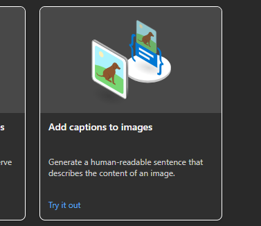

## Reconhecimento Facial e transformação de imagens em Dados no Azure ML

### O que deve ser feito?
- [ ] Crie uma pasta chamada 'inputs' e salve as imagens que você utilizou
- [ ] Crie uma pasta chamado 'output' e salve os resultados de reconhecimento de texto nessas imagens
- [ ] Crie um arquivo chamado readme.md , deixe alguns prints descreva o processo, alguns insights e possibilidades que você aprendeu durante o conteúdo.
- [ ] Compartilhe conosco o link desse repositório através do botão 'entregar projeto'

### Procedimento

Esse desafio tem o objetivo de implementar o reconhecimento facial e de documentos utilizando o Azure Vision Studio. Para a realização dos testes, foi necessário acessar essa plataforma, explorando suas funcionalidades para criar uma solução eficaz.

1. Antes de acessar a plataforma, é necessário criar um recurso do Azure Ai Services. Isso pode ser feito dentro do [Portal do Azure](https://portal.azure.com/#home).

2. Depois disso, acesse o [Azure Vision Studio](https://portal.vision.cognitive.azure.com/gallery/featured) para começar a experimentar os recursos.

3. Agora vamos para os testes com Reconhecimento de imagens

**Reconhecimento de rostos em imagens**

1. Na tela inicial do Vision Studio, acesse a aba **Face**

2. Você pode selecionar tanto as imagens que a Microsoft disponibiliza para testes ou fazer upload de uma imagem sua.

No meu caso, escolhi uma imagem minha

3. O Resultado irá aparecer abaixo, com o rosto detectado marcado na imagem e um pequeno prompt ao lado.

**Descrição de cenários**

1. Novamente na tela inicial, acesse a aba **Image Analysis**

2. Selecione a opção **Add captions to images**

3. Novamente ele irá permitir que você escolha uma imagem ou faça upload. O Resultado é um prompt em inglês com uma breve descrição do que foi detectado na imagem

### *Insights* e conclusões