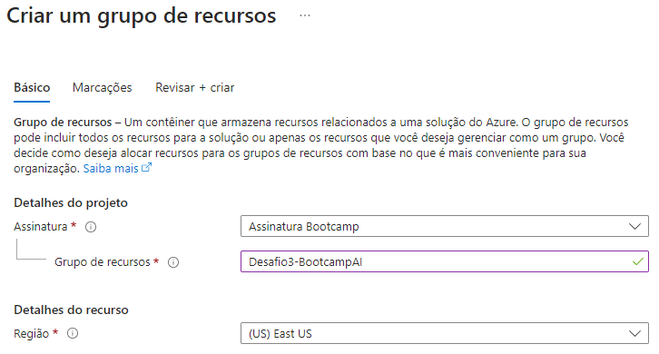
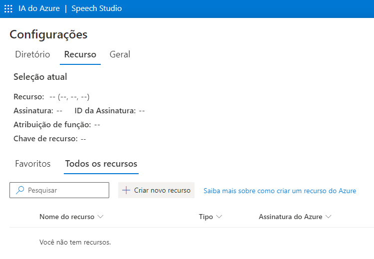
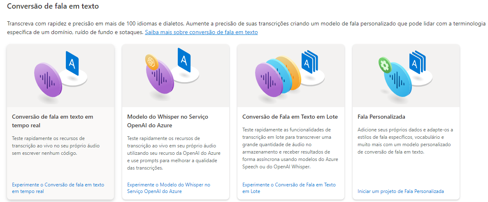
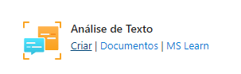
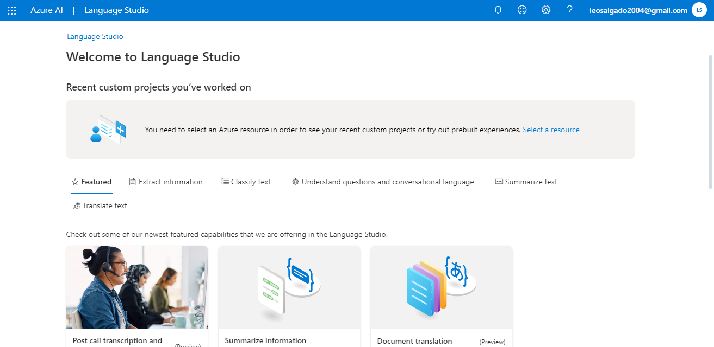
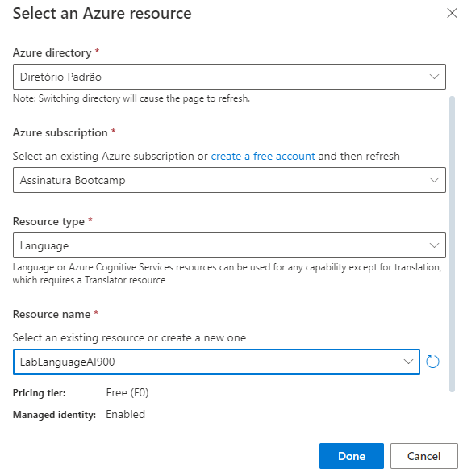
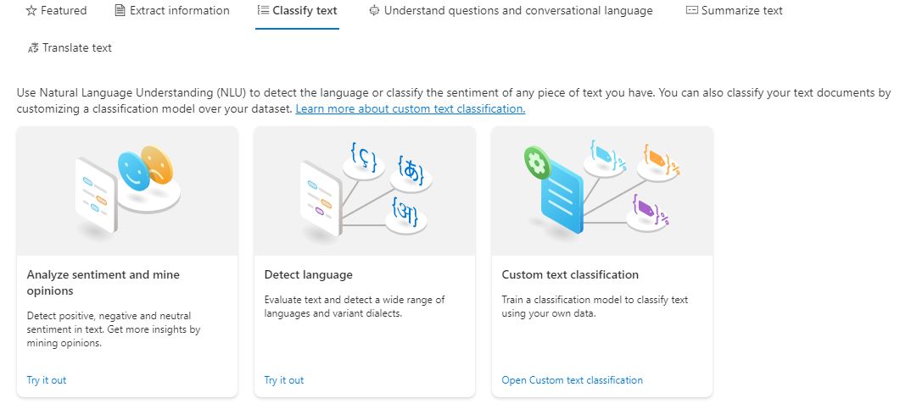
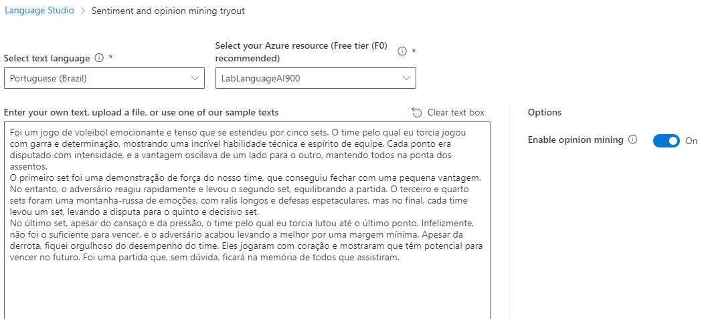
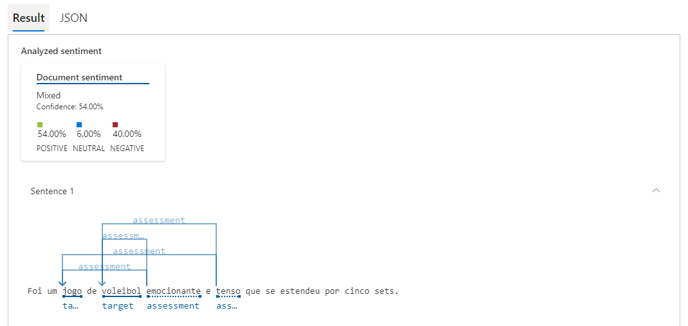
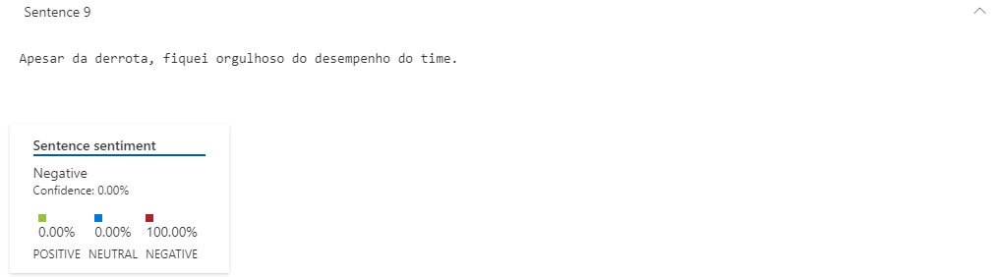

## Análise de Sentimentos com Language Studio no Azure AI

### O que deve ser feito?

- [ ] Crie uma pasta chamada 'inputs' e crie um documento de texto com algumas sentenças
- [ ] Crie um arquivo chamado readme.md , deixe alguns prints descreva o processo, alguns insights e possibilidades que você aprendeu durante o conteúdo após a IA analisar suas sentenças
- [ ] Compartilhe conosco o link desse repositório através do botão 'entregar projeto'

### Procedimento

1. Inicialmente, vamos criar um grupo de recursos no [Portal do Azure](https://portal.azure.com/#home) para guardar nossos recursos

**Speech to text**

1. Diretamente dentro do [Speech Studio](https://speech.microsoft.com/portal) da Microsoft, vamos criar um novo recurso dentro do grupo de recursos que criamos

Você pode fazer isso indo nas configurações e selecionando **Criar novo recurso**

2. Com o recurso criado, volte para a página inicial e desça até a sessão **Conversão de Fala em texto** e selecione a primeira opção

3. Selecione o idioma do áudio para converter em texto e faça o upload. Você verá que aos poucos o áudio será transcrito em texto.

**Análise de texto**

1. No [Portal do Azure](https://portal.azure.com/#home), crie um recurso de **Análise de texto**

2. Com o recurso criado, acesse o portal do [Language Studio](https://language.cognitive.azure.com/home). 

3. No canto superior direito onde aparece seu nome, você pode selecionar o seu recurso para utilizar.

4. Na aba **Classify Text** selecione a opção **Analyze sentiment and mine opinions**

5. Selecione o idioma e adicione o texto para ser analisado.

6. No campo abaixo, ele irá colocar os resultados da análise.

### *Insights* e conclusões

**Conclusão e Insights**

A experiência com o Microsoft Speech Studio e Language Studio foi uma jornada de aprendizado. A capacidade dessas ferramentas de converter áudio em texto e realizar análises de sentimentos é impressionante e abre um mundo de possibilidades.

No entanto, como em qualquer tecnologia nova, foram identificados alguns erros nas análises. Isso é esperado e faz parte do processo de aprimoramento contínuo dessas ferramentas. Aqui estão alguns insights:

1. **Erros de Transcrição de Áudio**: Na conversão da música em texto, foram identificadas algumas divergências na letra. Talvez tenha acontecido por causa do ruído do som atrás da fala.

2. **Análise de Sentimentos**: Em algumas sentenças do texto, foi determinado o sentimento errado.

Em resumo, a experiência foi positiva e os insights obtidos são valiosos para o aprimoramento contínuo das ferramentas. Com o tempo e com mais dados, espera-se que a precisão do Microsoft Speech Studio e Language Studio continue a melhorar.