## Azure Cognitive Search: Utilizando AI Search para indexação e consulta de Dados

### O que deve ser feito?

- [x] Crie uma pasta chamada 'inputs' e crie um documento de texto com algumas sentenças
- [x] Crie um um arquivo readme.md descrevendo o passo a passo para se configurar uma pesquisa, assim como seus insights, possibilidades de ferramentas que se beneficiam com esse tipo de ferramenta e aprendizados adquiridos durante o processo.
- [x] Compartilhe conosco o link desse repositório através do botão 'entregar projeto'

Para uma pesquisa do Cognitive Search ser efetiva, é necessário seguir três passos:
1. Ingestão de dados
2. Enriquecimento de IA
3. Exploração de dados

Então, vamos lá!

### Procedimento

Esse procedimento foi feito baseado na [documentação da Microsoft](https://aka.ms/ai900-ai-search).

1. No [Portal do Azure](https://portal.azure.com/#home), vamos precisar criar três recursos: um **Azure AI Search**, um **Azure AI services** e uma **Conta de armazenamento**.

__* Lembre de colocar todos os recursos no mesmo grupo de recursos__
__** Lembre de colocar o Azure AI Search e o Azure AI services na mesma região__

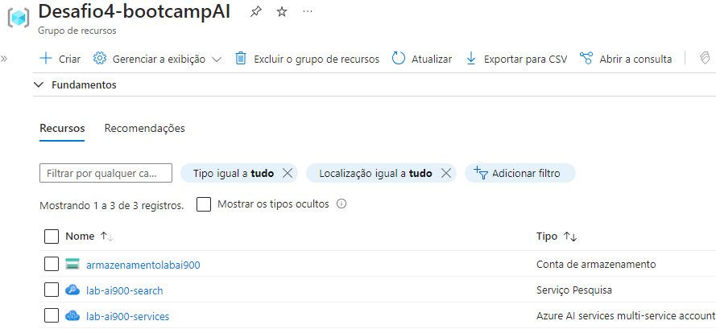

2. Na configuração da Conta de armazenamento, vá em configurações e marque como _habilitado_ a opção **Permitir acesso anônimo ao blob**. 

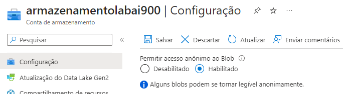

3. Na conta de armazenamento, crie um novo container. No nível de acesso anônimo, selecione _container_.

4. Faça upload dos documentos de _review_ fornecidos na [documentação da Microsoft](https://aka.ms/mslearn-coffee-reviews). Para facilitar, eles também estão disponíveis neste repositório.

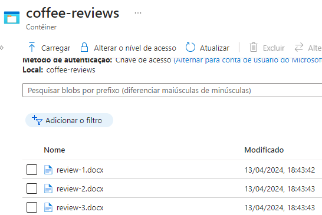

5. No AI Search, selecione a opção para importar os dados e configure a conexão com a conta de armazenamento. Conforme as configurações abaixo

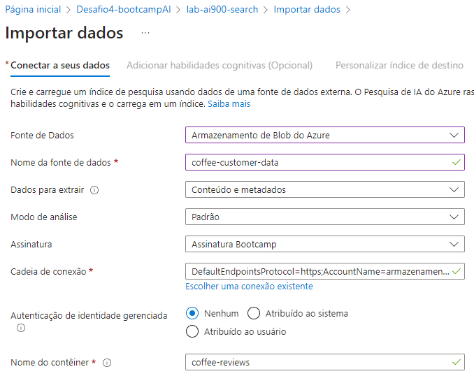

6. Na próxima página, de **Adicionar habilidades cognitivas**, anexe o AI services que foi criado. Em adicionar enriquecimentos, siga os seguintes passos

- Marque "Habilitar OCR e mesclar todo o texto no campo **merged_content**"
- Certifique-se de que o campo _Dados de origem_ esteja definido como **merged_content**
- Altere o nível de granularidade de enriquecimento para Páginas (blocos de 5.000 caracteres)
- Não selecione _Habilitar enriquecimento incremental_

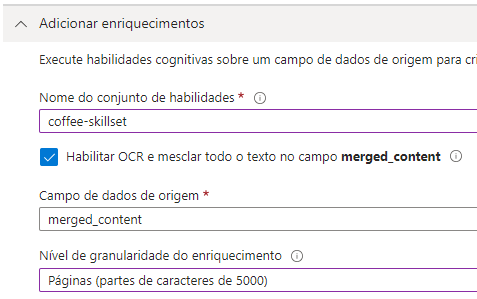

7. Marque os seguintes campos de habilidades cognitivas: 

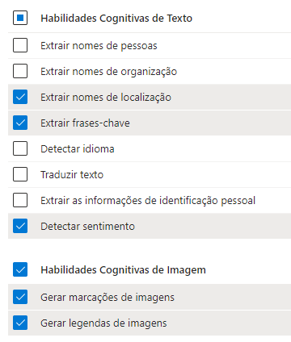

8. Na parte de Salvar os enriquecimentos, selecione seu container de armazenamento e marque todas a opções de projeção.

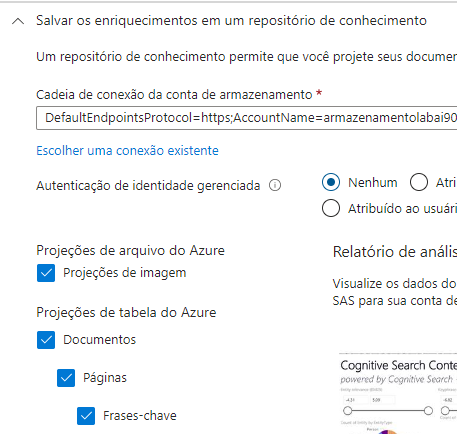

9. No próximo campo, marque a opção filtrável

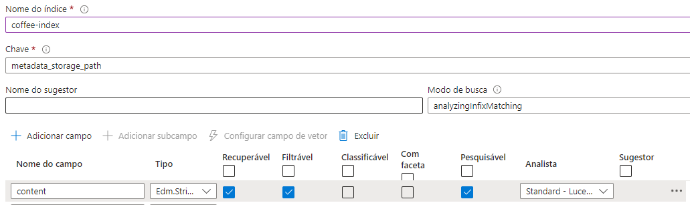

10. Por fim, crie um indexador e deixa a agenda para executar apenas uma vez

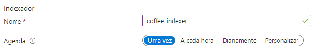

11. Se tudo tiver dado certo, você poderá ver o seu indexador assim:

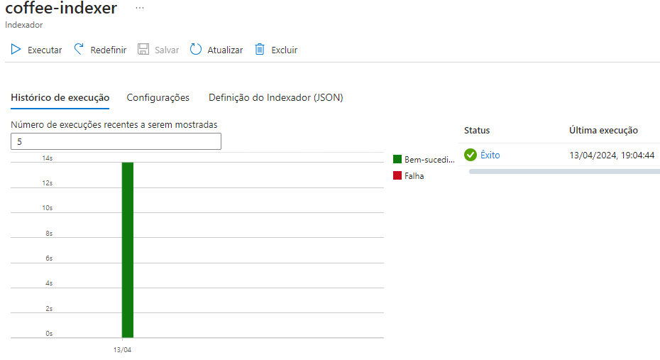

12. Agora no Gerenciador de Pesquisa do AI Search, você pode realizar pesquisas na sua base dados

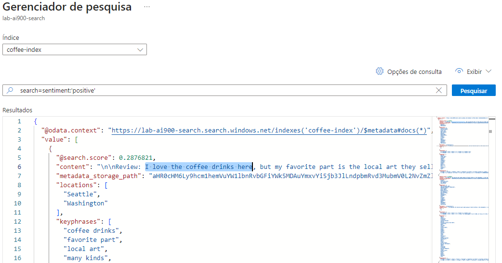

### *Insights* e conclusões

A partir desse laboratório foi possível entender como capacidade de enriquecimento de IA permite que os usuários obtenham insights mais profundos e relevantes a partir de seus dados. A experiência de realizar um laboratório do Azure AI Search foi muito interessante e simples, o que torna ainda mais atrativo o serviço.

