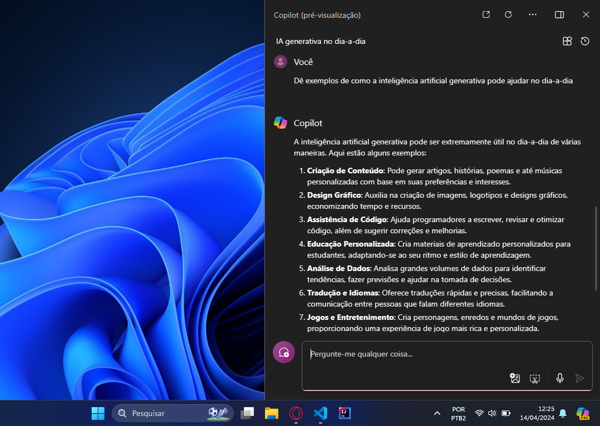
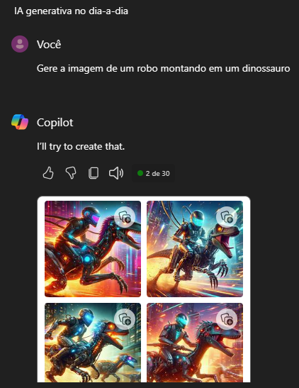

## Explorando os Recursos de IA Generativa com Copilot e OpenAI

O último desafio é o mais simples, então vou me resumir a alguns passo apenas.

Para usar o Copilot, eu fui direto na integração com o Sistema Operacional do Windows 11.

